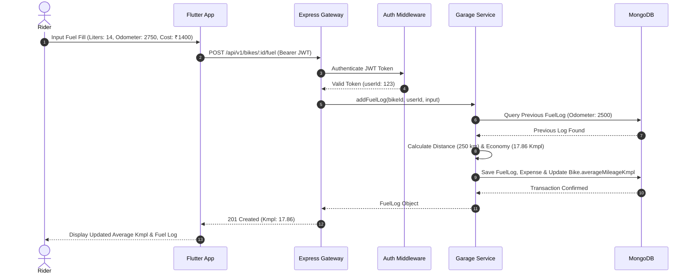

# 🔄 RidePulse Sequence Diagrams

This directory contains interaction sequence diagrams for key user workflows, authentication, digital garage operations, SOS triggering, and real-time mesh networking.

## Fuel Fill & Economy Calculation Sequence

