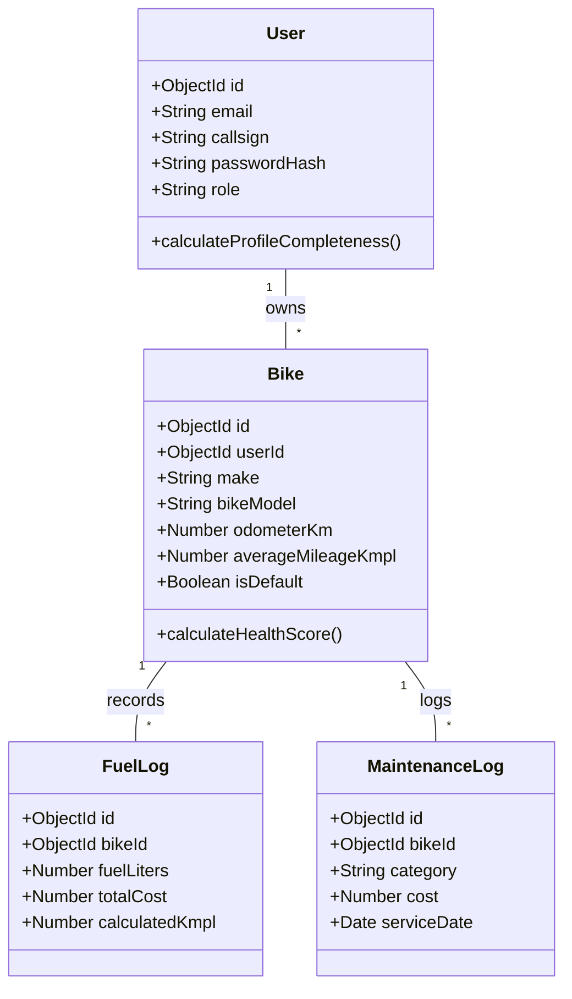

# 📐 RidePulse Unified Modeling Language (UML) Diagrams

This directory contains class diagrams, component diagrams, state machine diagrams, and system deployment architecture diagrams.

## System Class Diagram

